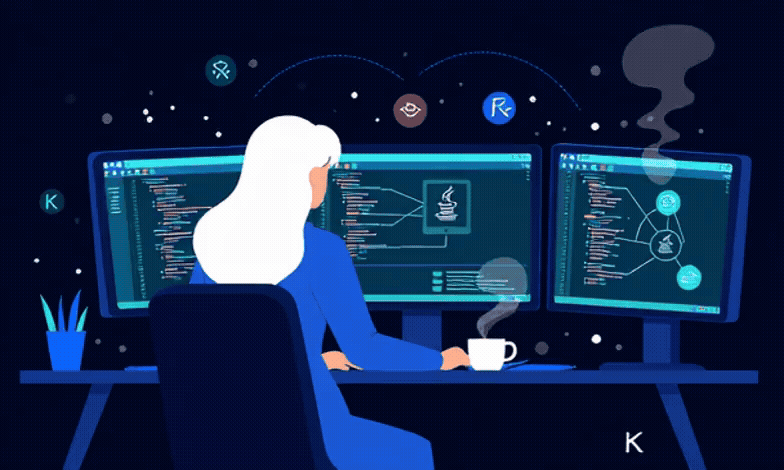
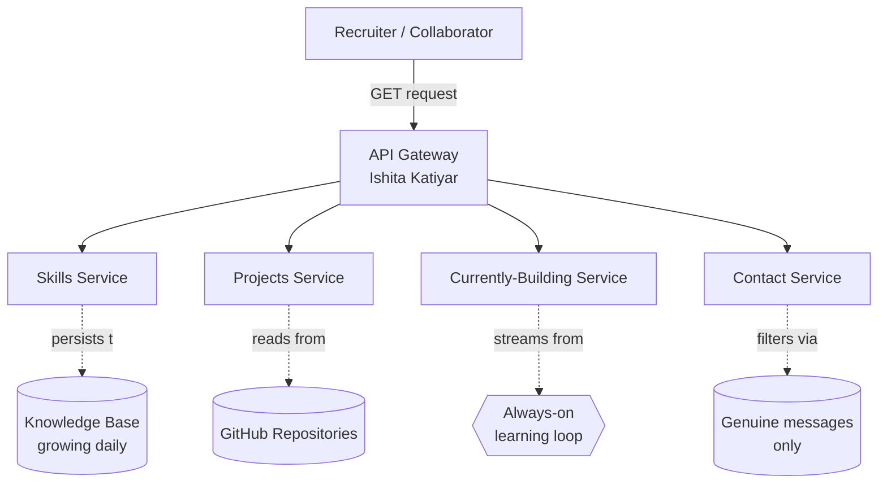

<div align="center">
  
</div>

<br>

```
  ___     _     _ _          _  __     _   _                  
 |_ _|___| |__ (_) |_ __ _  | |/ /__ _| |_(_)_   _  __ _ _ __ 
  | |/ __| '_ \| | __/ _` | | ' // _` | __| | | | |/ _` | '__|
  | |\__ \ | | | | || (_| | | . \ (_| | |_| | |_| | (_| | |   
 |___|___/_| |_|_|\__\__,_| |_|\_\__,_|\__|_|\__, |\__,_|_|   
                                             |___/            
 :: Ishita Katiyar ::                                   (v1.0.0)

2026-06-12 09:41:02.118  INFO 1 --- [main] c.ishitakatiyar.Profile : Starting Profile using Java 21
2026-06-12 09:41:02.121  INFO 1 --- [main] c.ishitakatiyar.Profile : No active profile set — running on "ambition"
2026-06-12 09:41:02.847  INFO 1 --- [main] o.s.b.w.embedded.tomcat.TomcatWebServer : Tomcat started on port 8080 (https://github.com/ishita3075)
```

<div align="center">

[;Bean+%27springBootExpertise%27+registered+(primary);Bean+%27growthMindset%27+registered+(never+recycled);Started+Profile+in+2.847+seconds;%3A%3A+Always+running+%3A%3A)](https://git.io/typing-svg)

</div>

---

## System Architecture



---

## `DeveloperController.java`

```java
@RestController
@RequestMapping("/developer")
public class IshitaKatiyar {

    private final String role       = "Backend && System Design";
    private final String location   = "India";
    private final String status     = "Student shipping anyway";
    private final String philosophy = "Code like prose. Systems scale.";

    private final List<String> openTo = List.of(
        "collaborations", "open-source", "projects"
    );

    @GetMapping
    public ResponseEntity<IshitaKatiyar> getProfile() {
        return ResponseEntity.ok(this);
    }

    @PostMapping("/connect")
    public ResponseEntity<String> connect(@RequestBody String message) {
        return ResponseEntity.ok("Connection established!");
    }
}
```

---

## `pom.xml`

<div align="center">
  <kbd>
    <br>
    &nbsp;&nbsp;&nbsp;&nbsp;  &nbsp;&nbsp;&nbsp;&nbsp;
    <br>
    &nbsp;
  </kbd>
</div>

<br>

<details>
<summary><b>View Maven pom.xml</b></summary>

```xml
<dependencies>
    <!-- core -->
    <dependency>
        <groupId>language</groupId>
        <artifactId>java-21</artifactId>
        <scope>daily-driver</scope>
    </dependency>

    <!-- framework -->
    <dependency>
        <groupId>framework</groupId>
        <artifactId>spring-boot-3</artifactId>
        <scope>primary</scope>
    </dependency>

    <!-- persistence -->
    <dependency>
        <groupId>database</groupId>
        <artifactId>postgresql</artifactId>
    </dependency>
    <dependency>
        <groupId>database</groupId>
        <artifactId>mysql</artifactId>
    </dependency>

    <!-- performance -->
    <dependency>
        <groupId>cache</groupId>
        <artifactId>redis</artifactId>
        <scope>runtime</scope>
    </dependency>

    <!-- security -->
    <dependency>
        <groupId>auth</groupId>
        <artifactId>spring-security-jwt</artifactId>
    </dependency>

    <!-- infra -->
    <dependency>
        <groupId>devops</groupId>
        <artifactId>docker</artifactId>
        <scope>provided</scope>
    </dependency>
    <dependency>
        <groupId>devops</groupId>
        <artifactId>linux</artifactId>
        <scope>system</scope>
    </dependency>

    <!-- tooling -->
    <dependency>
        <groupId>tools</groupId>
        <artifactId>git</artifactId>
        <scope>essential</scope>
    </dependency>
</dependencies>
```
</details>

---

## `/actuator/beans`

<table width="100%">
  <thead>
    <tr>
      <th align="left" width="30%">Project Bean Name</th>
      <th align="left" width="15%">Type</th>
      <th align="left" width="25%">Dependencies (Stack)</th>
      <th align="left" width="15%">Status</th>
      <th align="left" width="15%">Repository</th>
    </tr>
  </thead>
  <tbody>
    <tr>
      <td><strong>contractIntelligencePlatformBean</strong></td>
      <td><code>SpringBootApplication</code></td>
      <td>
        
      </td>
      <td><code>RUNNING</code></td>
      <td><a href="https://github.com/ishita3075/Contract-analyzer"></a></td>
    </tr>
    <tr>
      <td><strong>aarambhSafetyAppBackendBean</strong></td>
      <td><code>SpringBootApplication</code></td>
      <td>
        
      </td>
      <td><code>RUNNING</code></td>
      <td><a href="https://github.com/ishita3075/Aarambh-App-Backend"></a></td>
    </tr>
    <tr>
      <td><strong>plannedFutureModule</strong></td>
      <td><code>PlannedModule</code></td>
      <td>
        <code>N/A</code>
      </td>
      <td><code>INITIALIZING</code></td>
      <td>-</td>
    </tr>
  </tbody>
</table>

<details>
<summary><b>View Raw Actuator JSON Payload</b></summary>

```json
{
  "contexts": {
    "profile": {
      "beans": {
        "contractIntelligencePlatformBean": {
          "scope": "singleton",
          "type": "SpringBootApplication",
          "dependencies": ["postgresRepository", "springSecurityJwt", "ollamaAIClient"],
          "status": "RUNNING",
          "resource": "https://github.com/ishita3075/Contract-analyzer"
        },
        "aarambhSafetyAppBackendBean": {
          "scope": "singleton",
          "type": "SpringBootApplication",
          "dependencies": ["groqWhisper", "kotlinSilentSMS", "cloudinaryStorage"],
          "status": "RUNNING",
          "resource": "https://github.com/ishita3075/Aarambh-App-Backend"
        },
        "plannedFutureModule": {
          "scope": "prototype",
          "type": "PlannedModule",
          "status": "NOT_YET_INITIALIZED",
          "resource": null
        }
      }
    }
  }
}
```

</details>

---

## `/actuator/health`

```json
{
  "status": "UP",
  "components": {
    "education":   { "status": "UP", "details": { "academicStatus": "student", "major": "Computer Science" } },
    "availability":{ "status": "UP", "details": { "openFor": ["internships", "backend-roles", "open-source"] } },
    "focus":         { "status": "UP", "details": { "primary": "distributed-systems", "secondary": "spring-ecosystem" } }
  }
}
```

## `/actuator/info`

```json
{
  "currently": {
    "building": "Aarambh Women's Safety App & CIP Contract Analyzer",
    "learning": ["Spring Boot 3.4", "Local AI Inference (Ollama)", "React Native & Expo SDK 54", "Kotlin Native Modules"],
    "reading":  "Clean Architecture by Robert C. Martin"
  }
}
```

<details>
<summary><b>View Additional Actuator Endpoints (/env, /loggers)</b></summary>

## `/actuator/env`

```json
{
  "TIMEZONE": "Asia/Kolkata (IST)",
  "RESPONSE_TIME": "within 24 hours",
  "DEEP_WORK_WINDOW": "09:00-11:00 (focus time)",
  "COFFEE_REQUIRED": true
}
```

## `/actuator/loggers`

```json
{
  "levels": ["INFO", "WARN", "ERROR", "TRACE"],
  "loggers": {
    "com.ishitakatiyar.deadlines": {
      "configuredLevel": "WARN",
      "effectiveLevel": "WARN"
    },
    "com.ishitakatiyar.coffee": {
      "configuredLevel": "TRACE",
      "effectiveLevel": "TRACE"
    },
    "com.ishitakatiyar.sleep": {
      "configuredLevel": "ERROR",
      "effectiveLevel": "OFF"
    }
  }
}
```

</details>

---

## `/actuator/metrics`

<div align="center">

<table border="0"><tr>
<td>
  
</td>
<td>
  
</td>
</tr></table>

<br>


<br>

[](https://github.com/ashutosh00710/github-readme-activity-graph)

</div>

---

## `/actuator/contribution-graph`

<div align="center">
  <picture>
    <source media="(prefers-color-scheme: dark)" srcset="https://raw.githubusercontent.com/ishita3075/ishita3075/output/github-contribution-grid-snake-dark.svg">
    <source media="(prefers-color-scheme: light)" srcset="https://raw.githubusercontent.com/ishita3075/ishita3075/output/github-contribution-grid-snake.svg">
    
  </picture>
</div>

---

## Shutdown Hooks (Contact)

<table width="100%">
  <thead>
    <tr>
      <th align="left" width="25%">Service Listener</th>
      <th align="left" width="20%">Channel</th>
      <th align="left" width="35%">Endpoint Address</th>
      <th align="left" width="20%">Connection Status</th>
    </tr>
  </thead>
  <tbody>
    <tr>
      <td><code>GitHubListener</code></td>
      <td> GitHub</td>
      <td><a href="https://github.com/ishita3075"><code>github.com/ishita3075</code></a></td>
      <td><code>LISTENING</code></td>
    </tr>
    <tr>
      <td><code>LinkedInListener</code></td>
      <td> LinkedIn</td>
      <td><a href="https://www.linkedin.com/in/ishita-katiyar-backend-developer"><code>in/ishita-katiyar-backend-developer</code></a></td>
      <td><code>LISTENING</code></td>
    </tr>
    <tr>
      <td><code>EmailListener</code></td>
      <td> Email</td>
      <td><a href="mailto:iishitakatiyar@gmail.com"><code>iishitakatiyar@gmail.com</code></a></td>
      <td><code>LISTENING</code></td>
    </tr>
  </tbody>
</table>

---

<details>
<summary><b>View System Diagnostics & Logs (Exception, Git Log, Shutdown Logs)</b></summary>

### Exception Log

```
Exception in thread "main" com.ishitakatiyar.exception.StillUnderConstructionException: Semester in progress; exams pending
	at com.ishitakatiyar.Brain.handleLoad(Brain.java:102)
	at com.ishitakatiyar.Developer.shipFeatures(Developer.java:242)
	at com.ishitakatiyar.Profile.main(Profile.java:42)
Caused by: java.lang.OutOfMemoryError: TooManyOpenTabsException: Heap space exhausted by Wikipedia rabbit holes
	at com.ishitakatiyar.Curiosity.explore(Curiosity.java:1337)
	at java.base/java.lang.Thread.run(Thread.java:1583)

  [WARN] Exception caught by com.ishitakatiyar.advice.GlobalExceptionHandler
  [INFO] Exception logged, suppressed, and scheduled for post-exam review
  [INFO] JVM context restored; application continues running normally
```

### Git Log (`git log --oneline --graph`)

```
* 9f8a3c1 (HEAD -> main, origin/main) feat: integrate spring security + jwt auth for backend services
* 7ea2d1c docs: add application context schema and actuator diagnostics
* 5b2e9d4 feat: add database indexing and cache configuration with redis
* 3a18db0 refactor: move core domain entities to clean architecture layout
* 1a0c7f2 feat: initialize spring boot application with maven wrapper
* 0000000 init: first commit (hello world)
```

### Shutdown Hook Logs

```
2026-06-12 23:59:59.000  INFO 1 --- [Thread-2] c.ishitakatiyar.Profile : Registering shutdown hook: ContactListener
2026-06-12 23:59:59.012  INFO 1 --- [Thread-2] c.ishitakatiyar.ContactListener : Listening on: github · linkedin · email
2026-06-12 23:59:59.020  INFO 1 --- [Thread-2] c.ishitakatiyar.ContactListener : Mapped endpoints ready for connection requests.
```

```
2026-06-12 23:59:59.999  INFO 1 --- [SpringApplicationShutdownHook] c.ishitakatiyar.Profile : Closing ApplicationContext
2026-06-12 23:59:59.999  INFO 1 --- [SpringApplicationShutdownHook] c.ishitakatiyar.Profile : Thanks for stopping by, /ishita3075

Process finished with exit code 0
```

</details>

---

<div align="center">


</div>
