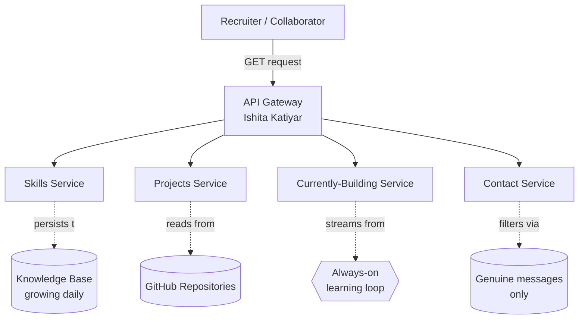

<!--
  ════════════════════════════════════════════════════════════════════
   ASSETS TO CREATE — three things, ranked by impact
  ════════════════════════════════════════════════════════════════════

   1. assets/boot.gif      → THE HERO. See full instructions below.
   2. assets/profile.png   → your photo, square-ish, 300–400px
   3. assets/demo.gif      → optional. "tail -f" of one project's logs.

   Search "YOUR_" to find every text placeholder in this file.
  ════════════════════════════════════════════════════════════════════
-->

<!--
  ════════════════════════════════════════════════════════════════════
   HERO ASSET — assets/boot.gif
  ════════════════════════════════════════════════════════════════════
   This is YOUR terminal printing YOUR custom Spring Boot banner.
   Nobody else can have this exact GIF — it's generated from your
   own banner.txt on your own machine. This is the entire point.

   STEP 1 — Generate ASCII art of your name
     → Go to patorjk.com/software/taag
     → Font: "Standard" or "Slant" both look great
     → Type your name, copy the ASCII output

   STEP 2 — Create a banner.txt (real Spring Boot feature)
     → In any Spring Boot project: src/main/resources/banner.txt
     → Paste your ASCII art name at the top
     → Below it add a tagline, e.g.:
         Backend Developer | Java | Spring Boot | ${spring-boot.version}

     Spring Boot automatically prints this file on EVERY startup —
     this is not a trick, it's a documented feature.

   STEP 3 — Record the terminal
     npm install -g terminalizer
     terminalizer record boot
       → run: ./mvnw spring-boot:run
       → wait for "Started Application in X seconds"
       → Ctrl+D
     terminalizer render boot -o boot.gif

   STEP 4 — Save as assets/boot.gif (~700px wide, under 5MB)

   No banner.txt yet? The static block below works as a placeholder —
   the README still looks complete without the GIF.
  ════════════════════════════════════════════════════════════════════
-->

<div align="center">
  
</div>

<br>

```
  ___     _     _ _          _  __     _   _                  
 |_ _|___| |__ (_) |_ __ _  | |/ /__ _| |_(_)_   _  __ _ _ __ 
  | |/ __| '_ \| | __/ _` | | ' // _` | __| | | | |/ _` | '__|
  | |\__ \ | | | | || (_| | | . \ (_| | |_| | |_| | (_| | |   
 |___|___/_| |_|_|\__\__,_| |_|\_\__,_|\__|_|\__, |\__,_|_|   
                                             |___/            
 :: Ishita Katiyar ::                                   (v1.0.0)

2026-06-12 09:41:02.118  INFO 1 --- [main] c.ishitakatiyar.Profile : Starting Profile using Java 21
2026-06-12 09:41:02.121  INFO 1 --- [main] c.ishitakatiyar.Profile : No active profile set — running on "ambition"
2026-06-12 09:41:02.847  INFO 1 --- [main] o.s.b.w.embedded.tomcat.TomcatWebServer : Tomcat started on port 8080 (https://github.com/ishita3075)
```

<div align="center">

[;Bean+%27springBootExpertise%27+registered+(primary);Bean+%27growthMindset%27+registered+(never+recycled);Started+Profile+in+2.847+seconds;%3A%3A+Always+running+%3A%3A)](https://git.io/typing-svg)

</div>

---

## System Architecture



---

<!--
  PROFILE PHOTO
  ─────────────────────────────────────────────────────────
  Floats beside the controller class below — like a Javadoc
  author tag. Square crop, 300-400px. GitHub avatar works
  fine too: https://github.com/ishita3075.png?size=400
  ─────────────────────────────────────────────────────────
-->

## `DeveloperController.java`

```java
@RestController
@RequestMapping("/developer")
public class IshitaKatiyar {

    private final String role       = "Backend && System Design";
    private final String location   = "India";
    private final String status     = "Student shipping anyway";
    private final String philosophy = "Code like prose. Systems scale.";

    private final List<String> openTo = List.of(
        "collaborations", "open-source", "projects"
    );

    @GetMapping
    public ResponseEntity<IshitaKatiyar> getProfile() {
        return ResponseEntity.ok(this);
    }

    @PostMapping("/connect")
    public ResponseEntity<String> connect(@RequestBody String message) {
        return ResponseEntity.ok("Connection established!");
    }
}
```

---

## `pom.xml`

<table width="100%">
<tr>
<td width="650">

```xml
<!-- core -->
<dependency>
    <groupId>language</groupId>
    <artifactId>java-21</artifactId>
    <scope>daily-driver</scope>
</dependency>
```

</td>
<td width="250" align="center" valign="middle">

</td>
</tr>

<tr>
<td>

```xml
<!-- framework -->
<dependency>
    <groupId>framework</groupId>
    <artifactId>spring-boot-3</artifactId>
    <scope>primary</scope>
</dependency>
```

</td>
<td align="center" valign="middle">

</td>
</tr>

<tr>
<td>

```xml
<!-- persistence -->
<dependency>
    <groupId>database</groupId>
    <artifactId>postgresql</artifactId>
</dependency>
<dependency>
    <groupId>database</groupId>
    <artifactId>mysql</artifactId>
</dependency>
```

</td>
<td align="center" valign="middle">


</td>
</tr>

<tr>
<td>

```xml
<!-- performance -->
<dependency>
    <groupId>cache</groupId>
    <artifactId>redis</artifactId>
    <scope>runtime</scope>
</dependency>
```

</td>
<td align="center" valign="middle">

</td>
</tr>

<tr>
<td>

```xml
<!-- security -->
<dependency>
    <groupId>auth</groupId>
    <artifactId>spring-security-jwt</artifactId>
</dependency>
```

</td>
<td align="center" valign="middle">

</td>
</tr>

<tr>
<td>

```xml
<!-- infra -->
<dependency>
    <groupId>devops</groupId>
    <artifactId>docker</artifactId>
    <scope>provided</scope>
</dependency>
<dependency>
    <groupId>devops</groupId>
    <artifactId>linux</artifactId>
    <scope>system</scope>
</dependency>
```

</td>
<td align="center" valign="middle">


</td>
</tr>

<tr>
<td>

```xml
<!-- tooling -->
<dependency>
    <groupId>tools</groupId>
    <artifactId>git</artifactId>
    <scope>essential</scope>
</dependency>
```

</td>
<td align="center" valign="middle">

</td>
</tr>
</table>

---

## Application Context

<table width="100%">
  <thead>
    <tr>
      <th align="left" width="22%">Bean Name</th>
      <th align="left" width="13%">Scope</th>
      <th align="left" width="20%">Status</th>
      <th align="left" width="45%">Description / Boot Registry Logs</th>
    </tr>
  </thead>
  <tbody>
    <tr>
      <td><code>consistency</code></td>
      <td><code>singleton</code></td>
      <td>Active</td>
      <td>Singleton instance tracking daily commits, refactoring, and code reviews.</td>
    </tr>
    <tr>
      <td><code>systemDesignSkills</code></td>
      <td><code>singleton</code></td>
      <td>Scaling</td>
      <td>Compiling caching strategies, DB partitioning, and API gateway routes.</td>
    </tr>
    <tr>
      <td><code>cleanArchitecture</code></td>
      <td><code>singleton</code></td>
      <td>Active</td>
      <td>Enforcing separation of concerns. Monitored for circular dependencies.</td>
    </tr>
    <tr>
      <td><code>frontendSkills</code></td>
      <td><code>prototype</code></td>
      <td>Lazy-loaded</td>
      <td>Initialized on demand for responsive layouts and mobile viewports.</td>
    </tr>
    <tr>
      <td><code>growthMindset</code></td>
      <td><code>primary</code></td>
      <td>Core</td>
      <td>Autowired for continuous learning. Resilient under load, non-nullable.</td>
    </tr>
  </tbody>
</table>

---

## `/actuator/beans`

<table width="100%">
  <thead>
    <tr>
      <th align="left" width="30%">Project Bean Name</th>
      <th align="left" width="15%">Type</th>
      <th align="left" width="25%">Dependencies (Stack)</th>
      <th align="left" width="15%">Status</th>
      <th align="left" width="15%">Repository</th>
    </tr>
  </thead>
  <tbody>
    <tr>
      <td><strong>contractIntelligencePlatformBean</strong></td>
      <td><code>SpringBootApplication</code></td>
      <td>
        
      </td>
      <td><code>RUNNING</code></td>
      <td><a href="https://github.com/ishita3075/Contract-analyzer"></a></td>
    </tr>
    <tr>
      <td><strong>aarambhSafetyAppBackendBean</strong></td>
      <td><code>SpringBootApplication</code></td>
      <td>
        
      </td>
      <td><code>RUNNING</code></td>
      <td><a href="https://github.com/ishita3075/Aarambh-App-Backend"></a></td>
    </tr>
    <tr>
      <td><strong>plannedFutureModule</strong></td>
      <td><code>PlannedModule</code></td>
      <td>
        <code>N/A</code>
      </td>
      <td><code>INITIALIZING</code></td>
      <td>-</td>
    </tr>
  </tbody>
</table>

<details>
<summary><b>View Raw Actuator JSON Payload</b></summary>

```json
{
  "contexts": {
    "profile": {
      "beans": {
        "contractIntelligencePlatformBean": {
          "scope": "singleton",
          "type": "SpringBootApplication",
          "dependencies": ["postgresRepository", "springSecurityJwt", "ollamaAIClient"],
          "status": "RUNNING",
          "resource": "https://github.com/ishita3075/Contract-analyzer"
        },
        "aarambhSafetyAppBackendBean": {
          "scope": "singleton",
          "type": "SpringBootApplication",
          "dependencies": ["groqWhisper", "kotlinSilentSMS", "cloudinaryStorage"],
          "status": "RUNNING",
          "resource": "https://github.com/ishita3075/Aarambh-App-Backend"
        },
        "plannedFutureModule": {
          "scope": "prototype",
          "type": "PlannedModule",
          "status": "NOT_YET_INITIALIZED",
          "resource": null
        }
      }
    }
  }
}
```

</details>

<!--
  OPTIONAL: assets/demo.gif
  ─────────────────────────────────────────────────────────
  A "tail -f" of your flagship project's logs while you hit
  it with curl/Postman. Record with the same terminalizer
  flow as the boot GIF. Drop the line below back in if used:

  <div align="center">
    
  </div>
  ─────────────────────────────────────────────────────────
-->

---

## `/actuator/health`

```json
{
  "status": "UP",
  "components": {
    "education":   { "status": "UP", "details": { "academicStatus": "student", "major": "Computer Science" } },
    "availability":{ "status": "UP", "details": { "openFor": ["internships", "backend-roles", "open-source"] } },
    "focus":         { "status": "UP", "details": { "primary": "distributed-systems", "secondary": "spring-ecosystem" } }
  }
}
```

## `/actuator/info`

```json
{
  "currently": {
    "building": "Aarambh Women's Safety App & CIP Contract Analyzer",
    "learning": ["Spring Boot 3.4", "Local AI Inference (Ollama)", "React Native & Expo SDK 54", "Kotlin Native Modules"],
    "reading":  "Clean Architecture by Robert C. Martin"
  }
}
```

## `/actuator/env`

```json
{
  "TIMEZONE": "Asia/Kolkata (IST)",
  "RESPONSE_TIME": "within 24 hours",
  "DEEP_WORK_WINDOW": "09:00-11:00 (focus time)",
  "COFFEE_REQUIRED": true
}
```

---

## `/actuator/loggers`

```json
{
  "levels": ["INFO", "WARN", "ERROR", "TRACE"],
  "loggers": {
    "com.ishitakatiyar.deadlines": {
      "configuredLevel": "WARN",
      "effectiveLevel": "WARN"
    },
    "com.ishitakatiyar.coffee": {
      "configuredLevel": "TRACE",
      "effectiveLevel": "TRACE"
    },
    "com.ishitakatiyar.sleep": {
      "configuredLevel": "ERROR",
      "effectiveLevel": "OFF"
    }
  }
}
```

---

## `/actuator/metrics`

<div align="center">

<table border="0"><tr>
<td>
  
</td>
<td>
  
</td>
</tr></table>

<br>


<br>

[](https://github.com/ashutosh00710/github-readme-activity-graph)

</div>

---

## Exception Log

```
Exception in thread "main" com.ishitakatiyar.exception.StillUnderConstructionException: Semester in progress; exams pending
	at com.ishitakatiyar.Brain.handleLoad(Brain.java:102)
	at com.ishitakatiyar.Developer.shipFeatures(Developer.java:242)
	at com.ishitakatiyar.Profile.main(Profile.java:42)
Caused by: java.lang.OutOfMemoryError: TooManyOpenTabsException: Heap space exhausted by Wikipedia rabbit holes
	at com.ishitakatiyar.Curiosity.explore(Curiosity.java:1337)
	at java.base/java.lang.Thread.run(Thread.java:1583)

  [WARN] Exception caught by com.ishitakatiyar.advice.GlobalExceptionHandler
  [INFO] Exception logged, suppressed, and scheduled for post-exam review
  [INFO] JVM context restored; application continues running normally
```

---

## `/actuator/contribution-graph`

<div align="center">
  <picture>
    <source media="(prefers-color-scheme: dark)" srcset="https://raw.githubusercontent.com/ishita3075/ishita3075/output/github-contribution-grid-snake-dark.svg">
    <source media="(prefers-color-scheme: light)" srcset="https://raw.githubusercontent.com/ishita3075/ishita3075/output/github-contribution-grid-snake.svg">
    
  </picture>
</div>

---

## Shutdown Hooks

```
2026-06-12 23:59:59.000  INFO 1 --- [Thread-2] c.ishitakatiyar.Profile : Registering shutdown hook: ContactListener
2026-06-12 23:59:59.012  INFO 1 --- [Thread-2] c.ishitakatiyar.ContactListener : Listening on: github · linkedin · email
2026-06-12 23:59:59.020  INFO 1 --- [Thread-2] c.ishitakatiyar.ContactListener : Mapped endpoints ready for connection requests.
```

<table width="100%">
  <thead>
    <tr>
      <th align="left" width="25%">Service Listener</th>
      <th align="left" width="20%">Channel</th>
      <th align="left" width="35%">Endpoint Address</th>
      <th align="left" width="20%">Connection Status</th>
    </tr>
  </thead>
  <tbody>
    <tr>
      <td><code>GitHubListener</code></td>
      <td> GitHub</td>
      <td><a href="https://github.com/ishita3075"><code>github.com/ishita3075</code></a></td>
      <td><code>LISTENING</code></td>
    </tr>
    <tr>
      <td><code>LinkedInListener</code></td>
      <td> LinkedIn</td>
      <td><a href="https://www.linkedin.com/in/ishita-katiyar-backend-developer"><code>in/ishita-katiyar-backend-developer</code></a></td>
      <td><code>LISTENING</code></td>
    </tr>
    <tr>
      <td><code>EmailListener</code></td>
      <td> Email</td>
      <td><a href="mailto:iishitakatiyar@gmail.com"><code>iishitakatiyar@gmail.com</code></a></td>
      <td><code>LISTENING</code></td>
    </tr>
  </tbody>
</table>

---

## `git log --oneline --graph`

```
* 9f8a3c1 (HEAD -> main, origin/main) feat: integrate spring security + jwt auth for backend services
* 7ea2d1c docs: add application context schema and actuator diagnostics
* 5b2e9d4 feat: add database indexing and cache configuration with redis
* 3a18db0 refactor: move core domain entities to clean architecture layout
* 1a0c7f2 feat: initialize spring boot application with maven wrapper
* 0000000 init: first commit (hello world)
```

---

<div align="center">

```
2026-06-12 23:59:59.999  INFO 1 --- [SpringApplicationShutdownHook] c.ishitakatiyar.Profile : Closing ApplicationContext
2026-06-12 23:59:59.999  INFO 1 --- [SpringApplicationShutdownHook] c.ishitakatiyar.Profile : Thanks for stopping by, /ishita3075

Process finished with exit code 0
```

<br>


</div>
